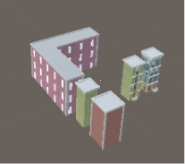
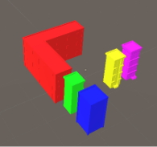
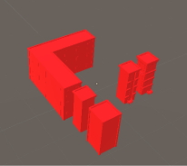
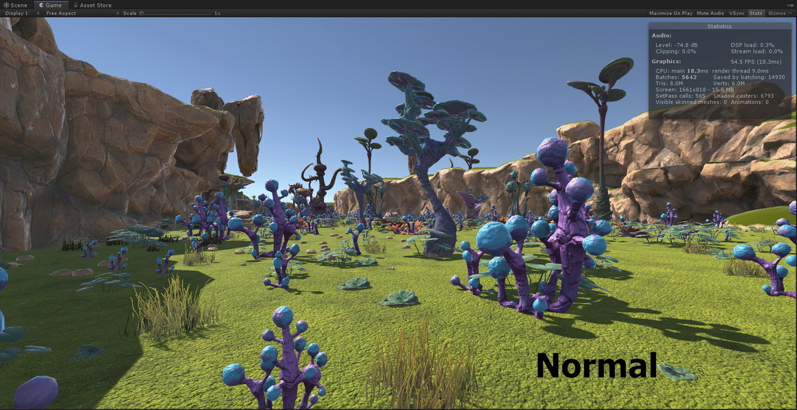

[](https://badges.cds.internal.unity3d.com/packages/com.unity.hlod/build-info?branch=master&testWorkflow=package-isolation)
[](https://badges.cds.internal.unity3d.com/packages/com.unity.hlod/dependants-info)
[](https://badges.cds.internal.unity3d.com/packages/com.unity.hlod/warnings-info?branch=master)


# HLOD system
It can replace multiple Static Mesh Actors with single, combined Static Mesh Actor at long view distances. This helps reduce the number of Actors that need to be rendered for the scene, increasing performance by lowering the number of draw calls per frame. 


| Render image  | Show draw calls | Show draw calls of HLOD |
| --- | --- | --- |
|  |   | |

Here is the result what the HLODSystem how can be helped it.


||DrawCalls|Tris|
|---|---|---|
|Normal|5642|8.0M|
|HLOD|952|3.9M|
|Rate|16.87%|48.75%|

## Prerequisites
### Unity
```
Unity Version: 2019.3.7f1

```
Currently, I developed in **2019.1.0b1**. Probably it works on the 2018.3 but I can't guarantee.

### Git 

You need Git Client which can work with GitHub.

If you don't have Git installed on your machine, download and install it from [Git Home][gitHome].


### Connecting to GitHub with SSH
To clone the project, your Git must be configured to work with SSH Authentication, as HLODSystem uses SSH Authentication to work with Git Submodules. Check [this][gitSSHSetup] link to set up your git to use SSH to connect to GitHub. 

## Getting the project
### Cloning
The project uses a number of other projects as dependencies, and they are included into it as Git Submodules.
To have a fully working project, you should those submodules included into the project after you clone the project.

First, run the following command to clone the project:
```sh
$ git clone git@github.com:Unity-Technologies/HLODSystem.git
```
After cloning is finished, navigate to the root folder of the project, and run the following command to initialize and clone all submodules:
```sh
$ git submodule update --init --recursive
```

## How to use
Please refer to this document:
https://docs.google.com/document/d/18HgBIr8oJweKaXtsIHZlh0s5HuXvQVmVfVcMPHAYS1A/edit#

Also, you can see [this project][demoProject] to how to apply to 3D game kit.


### License
Copyright (c) 2019 Unity Technologies ApS
Licensed under the Unity Companion License for Unity-dependent projects see [Unity Companion License][license].
Unless expressly provided otherwise, the Software under this license is made available strictly on an **“AS IS”** BASIS WITHOUT WARRANTY OF ANY KIND, EXPRESS OR IMPLIED. Please review the license for details on these and other terms and conditions.


Document: https://docs.google.com/document/d/1OPYDNpwGFpkBorZ3GCpL9Z4ck-6qRRD1tzelUQ0UvFc

[license]: <https://unity3d.com/legal/licenses/Unity_Companion_License>
[gitHome]:<https://git-scm.com/downloads>
[gitSSHSetup]: <https://help.github.com/articles/connecting-to-github-with-ssh/>
[sampleBranch]: <https://github.com/Unity-Technologies/HLODSystem/tree/samples>
[badgesLink]: <https://badges.cds.internal.unity3d.com/badge-gallery/com.unity.hlod?branch=PackageTests&proxied=true>
[demoProject]: <https://github.com/Unity-Technologies/HLODSystemDemo>
